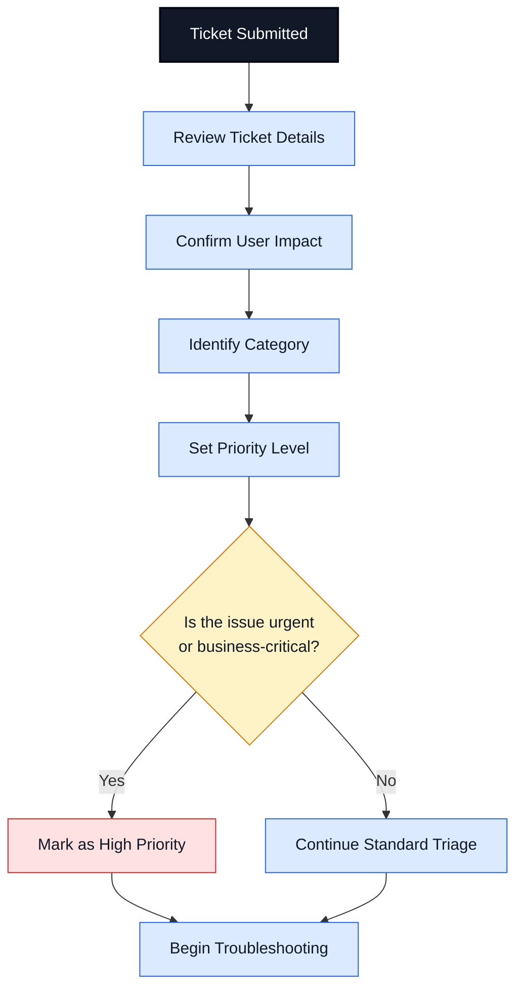
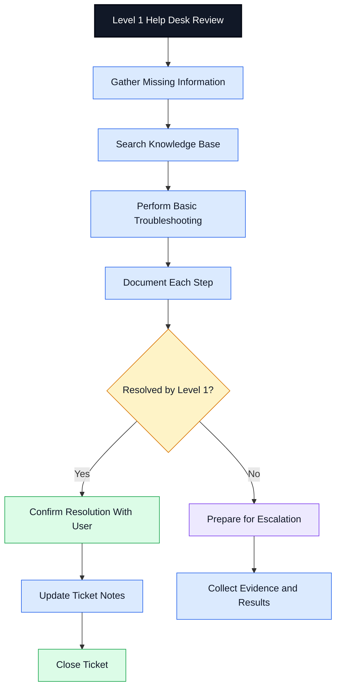
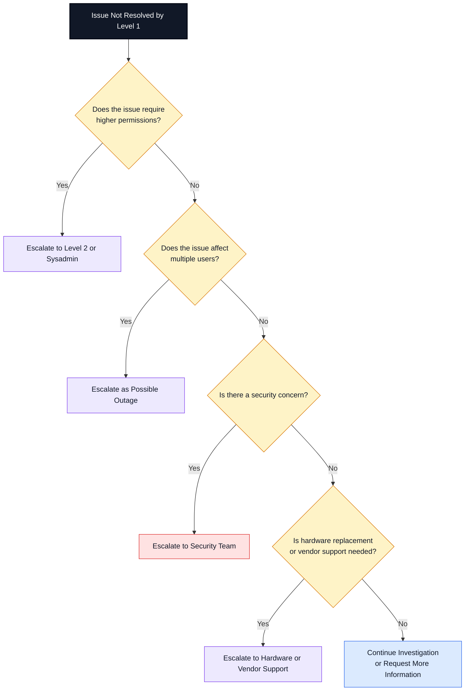
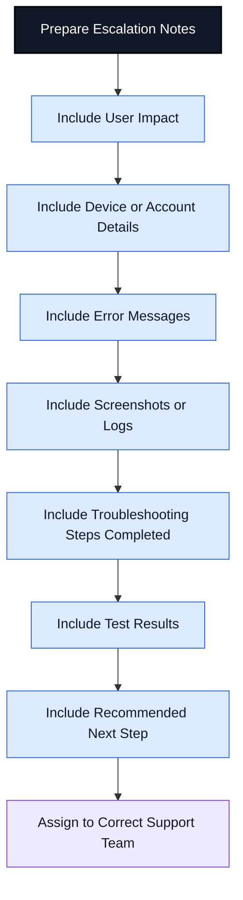
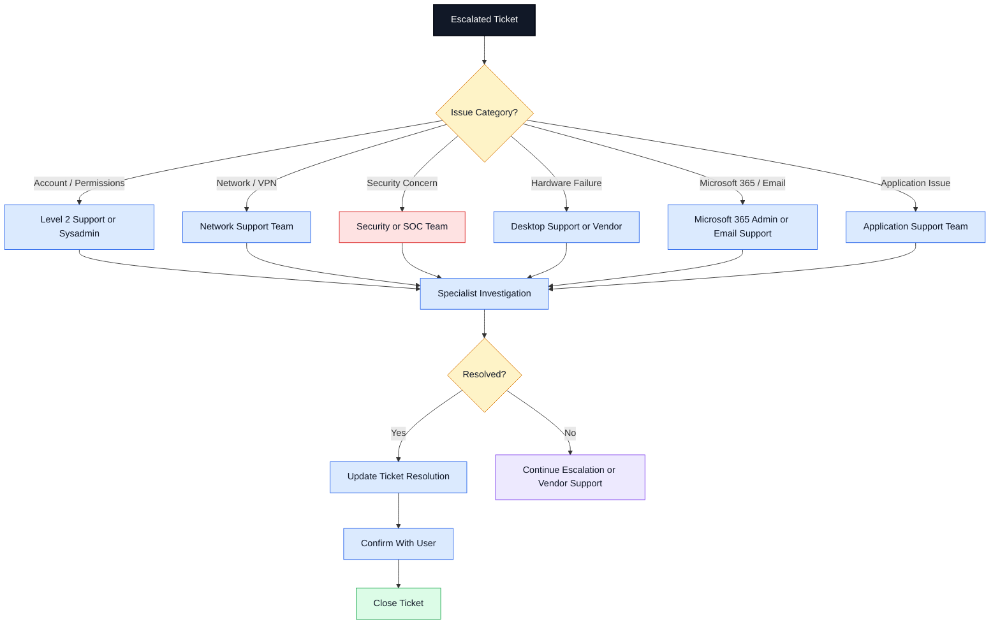
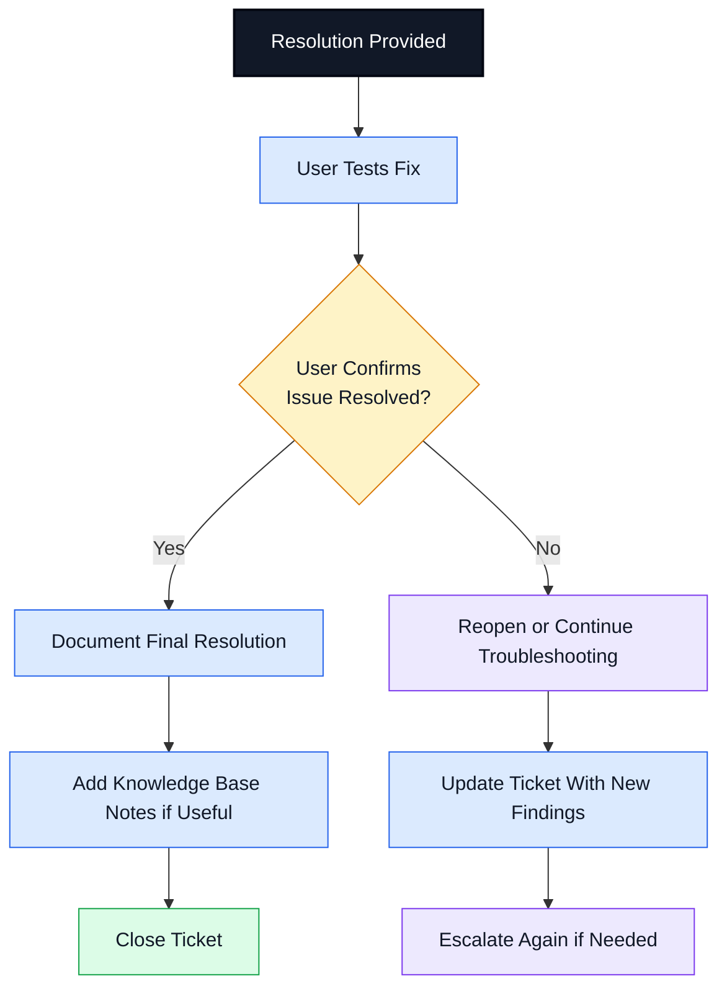

# Help Desk Escalation Workflow

## Purpose

This document shows a professional help desk escalation workflow for support tickets. It is designed for IT Support, Service Desk, Desktop Support, Technical Support, and Junior Systems Administrator documentation.

The workflow is separated into readable sections so it displays clearly on GitHub without needing to zoom in.

---

# 1. Ticket Intake and Triage Workflow

## Intake Notes

During ticket intake, confirm:

* User name
* Contact method
* Device name
* Issue description
* Error message
* When the issue started
* Business impact
* Number of users affected
* Screenshots or examples if available

---

# 2. Level 1 Troubleshooting Workflow

## Common Level 1 Troubleshooting

| Issue Type     | Level 1 Actions                                    |
| -------------- | -------------------------------------------------- |
| Password issue | Verify identity, reset password, confirm sign-in   |
| Outlook issue  | Test Outlook Web, restart Outlook, check profile   |
| VPN issue      | Confirm internet, restart VPN, check credentials   |
| Printer issue  | Check printer status, queue, driver, print spooler |
| Network issue  | Check Wi-Fi/Ethernet, IP address, DNS, gateway     |
| Software issue | Restart app, check updates, reinstall if approved  |

---

# 3. Escalation Decision Workflow

## Escalation Triggers

Escalate when:

* The issue requires admin permissions.
* Multiple users are affected.
* A business-critical service is down.
* There is a possible security incident.
* The user account may be compromised.
* Hardware failure is suspected.
* The issue involves servers, network infrastructure, or backend systems.
* The same issue keeps returning after troubleshooting.
* Vendor support is required.

---

# 4. Escalation Notes Checklist

## Strong Escalation Notes Should Include

| Field            | Example                                                    |
| ---------------- | ---------------------------------------------------------- |
| User impact      | User cannot access email or complete work                  |
| Affected device  | Laptop name, workstation, printer, or mobile device        |
| Affected service | Outlook, VPN, Microsoft 365, network, printer, application |
| Error message    | Exact error shown to the user                              |
| Scope            | One user, department, or multiple users                    |
| Steps completed  | Restarted app, checked network, tested web version         |
| Results          | Outlook Web worked, desktop app failed                     |
| Screenshots/logs | Attached if available                                      |
| Priority         | Low, medium, high, or critical                             |
| Next step        | Level 2 review, network team, security team, vendor        |

---

# 5. Escalation Routing Workflow

## Routing Examples

| Issue                                    | Escalation Team           |
| ---------------------------------------- | ------------------------- |
| User needs admin-level access change     | Level 2 or Sysadmin       |
| VPN connects but internal resources fail | Network Support           |
| Suspicious login or phishing report      | Security Team             |
| Laptop has hardware failure              | Desktop Support or Vendor |
| Shared mailbox permission issue          | Microsoft 365 Admin       |
| Business app error                       | Application Support       |

---

# 6. Ticket Closure Workflow

## Ticket Closure Notes

A good closure note should include:

* What the user reported
* What troubleshooting was completed
* What fixed the issue
* Whether the user confirmed the fix
* Any follow-up action
* Any prevention or knowledge base note

## Example Closure Note

User reported Outlook was not syncing on the desktop app. Confirmed Outlook Web was working, created a new Outlook profile, and tested send/receive. User confirmed email was syncing successfully. Ticket closed.

---

# Portfolio Note

This workflow is part of a Help Desk Ticket Documentation Samples repo designed to demonstrate IT Support, Service Desk, Desktop Support, Technical Support, escalation, ticket writing, troubleshooting, and user-focused documentation skills.

## Disclaimer

This is a learning and portfolio documentation sample. It does not contain real user data, company information, passwords, credentials, or private ticket details.
